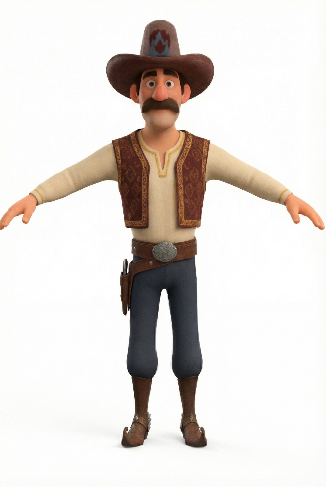
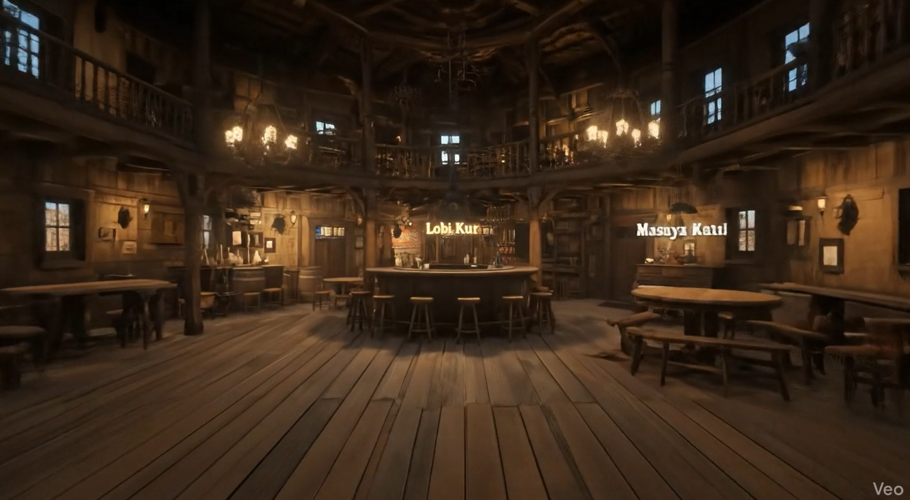
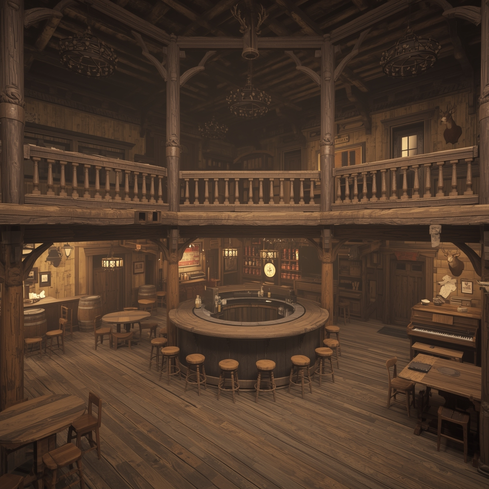

# Product Backlog URL

[BuzzedBusted](https://miro.com/app/board/uXjVJm6DaHc=/)

# Sprint 1
- Sprint boyunca belirlenen görevler hâlâ yürütülmeye devam etmekte olup, ekipler kendi sorumluluk alanlarındaki işleri paralel şekilde ilerletmektedir. Bu süreçte tamamlanan işler dokümante edilirken, devam eden görevler de bir sonraki sprint planlamasına aktarılmak üzere takip altına alınmıştır.
- **Backlog Düzeni:** Proje backlog'u oluşturulurken, Miro üzerinden "Team Developer" ve "Team Creative" olmak üzere iki ana takıma ayrıldık. Bu süreçte, projenin genel hatlarını belirleyerek gelecek sprintler için gerekli olan script türleri, animasyonlar, modeller, seler ve tasarımları önceden tespit ettik. Kanban panosu oluşturarak, daha önce belirlediğimiz bu materyalleri Sprint 1 için detaylandırdık ve görev dağılımlarını gerçekleştirdik. Görevlerin kolayca ayırt edilebilmesi için renk kodlaması kullandık: mavi kodlamayı, kırmızı modellemeyi, temsil etmektedir. 
- **Daily Scrum:** Whatsapp üzerinden günlük konuşmala sağlanıp, toplantılar içinse Google Meet üzerinden yapılmıştır. 
- Proje için ayrılan gruplar şu şekildedir;
  +   **Team Developer:** Yusuf Kansız, Anıl Moran, Buğrahan Deveci
  +   **Team Creative:** Buğrahan Deveci, Aybüke Altay
      + Team Developer projenin mekaniklerini, unity tarafında toplanmasını işlerken Team Creative ise modeller, tasarımlarla ilgilendi.
- **Sprint board update:** Sprint Board Screenshot: 
- 
 
<h3>Ürün Durumu: Ekran Görüntüleri</h3>

  
   
   
   
  
- **Sprint Review:** Çok oyunculu sistem başarıyla test edildi; buton etkileşimleri tüm istemcilerde senkronize çalıştı. Offline 5 oyunculu rol atama ve tur yönetim sistemi kuruldu. Creative ekip, mekânın genel hatlarını tasarlandı. Ayrıca kart tasarımları bootcampde kullanıldığı için aynı kartları kullanılması karar verildi
İlgili görev bir sonraki sprint'e aktarılacak ve görev takibi daha net rollerle yürütülecektir.
  + **Sprint Review katılımcıları:** Buğrahan Deveci, Aybüke Altay, Yusuf Kansız, Anıl Moran
- **Sprint Retrospective:**
  - Takım içi iletişimi güçlendirmek amacıyla toplantıların daha düzenli yapılmasına karar verildi. Bundan sonraki süreçte haftada iki gün, belirlenen sabit gün ve saatlerde takım toplantıları gerçekleştirilecek.
  - Bazı görevlerin zamanında tamamlanamaması ve iletişim eksikliği sebebiyle efor-saat planlamasının yetersiz olduğunu gösterdi. Görevler için daha gerçekçi süre tahminleri yapılacak ve her görev için gerekli zaman detaylı şekilde belirlenecek.
  - Görevlerin takibi sırasında bilgi kopuklukları yaşandı. Bir kişinin yaptığı işi diğer takım üyelerinin sonradan öğrenmesi zaman kaybına yol açtı. Bu nedenle tüm takım üyelerinin toplantılara eksiksiz katılması artık bir öncelik olması karar verilmiştir.
